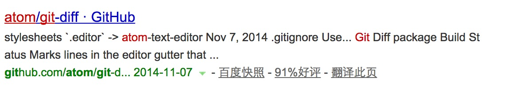

# MapReduce介绍
### `1.map对数据进行查询`
### `2、reduce 对查询的数据进行筛选，归类`
### `3、Apache Hadoop 和 Hadoop 生态圈`

```
1.Common

2.Avro

3.MapReduce

  分为map(寻址查询) reduce(计算统计)，把任务分割成很多块进行分批处理
4.HDFS  

  hadoop 的分布式文件系统，hadoop的基础数据存储方案
5.Pig

  为 map 和 reduce 函数提供的封装操作
6.Hive
  让精通SQL技能的分析师，分析数据，支持部分SQL查询

7.Hbase
  面向列的分布式数据库，实时随机读/写超大规模数据集

8.ZooKeeper
  是Hadoop的分布式协调服务

9.Sqoop
  导入导出传统关系型数据库到Hadoop集群，从而可以进行分析

```


