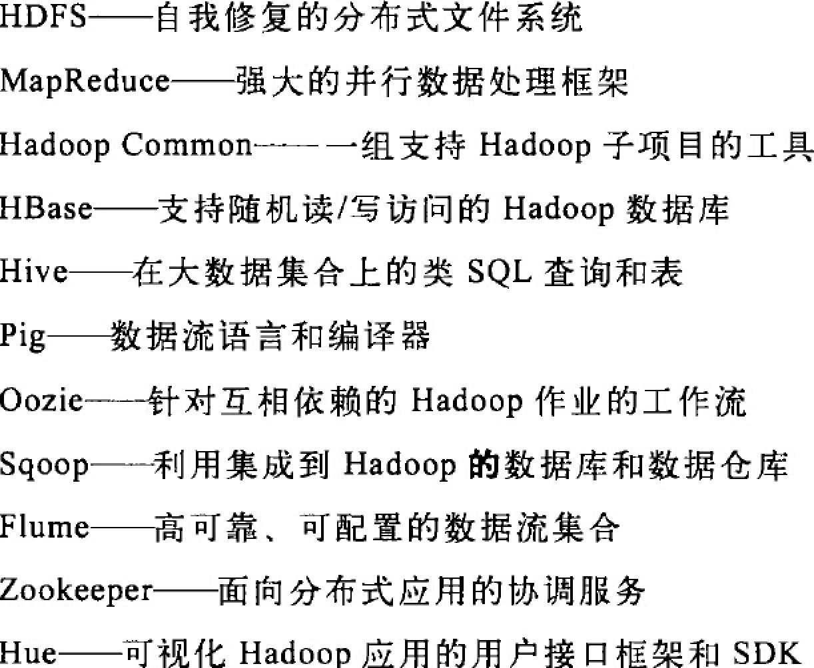

# MapReduce介绍(15-38)

### `1.map对数据进行查询`

### `2、reduce 对查询的数据进行筛选，归类`

### `3、Apache Hadoop 和 Hadoop 生态圈`

```
1.Common

2.Avro

3.MapReduce

  分为map(寻址查询) reduce(计算统计)，把任务分割成很多块进行分批处理
4.HDFS  

  hadoop 的分布式文件系统，hadoop的基础数据存储方案
5.Pig

  为 map 和 reduce 函数提供的封装操作
6.Hive
  让精通SQL技能的分析师，分析数据，支持部分SQL查询

7.Hbase
  面向列的分布式数据库，实时随机读/写超大规模数据集

8.ZooKeeper
  是Hadoop的分布式协调服务

9.Sqoop
  导入导出传统关系型数据库到Hadoop集群，从而可以进行分析

```


### `4、数据流`
Hadoop将作业分成若干个小人物(task)来执行，其中包括两类任务：map任务和reduce任务


# Hadoop 分布式文件系统(41-73)
### `1、HDFS设计`

### `2、HDFS概念 (43)`
HDFS工作的块 > 单个磁盘的块，减少寻址时间  
HDFS工作的块 > 单个磁盘的块，减少寻址时间

### `3、namenode 和 datanode (44)`

HDFS有2类工作节点

1)namenode 管理者  
管理文件系统给的命名空间，维护文件系统的树及整棵树内所有的文件和目录

2)datanode 工作者
是文件系统的工作节点，定期向namenode发送他们所存储块的列表

3)容错 (45)
namenode 损坏是灾难性的，会导致整个集群的文件系统无法使用，这里提供了2种机制

### `4、基本文件操作   (46)`
1) 基础复制等操作  
2) HDFS 访问权限

### `5、Hadoop 文件系统 (47)`
注：Hadoop 有一个抽象的文件系统概念，HDFS只是其中一个实现。
```
java抽象类org.apache.hadoop.fs.FileSystem定义了Hadoop中的一个文件系统接口,该抽象类有几个具体实现

1)文件系统API(48)

Local

HDFS

HFTP

HSFTP

HAR

hfs(云存储)

FTP

S3(原生)

S3(基于块)
```

### `6、接口(49) `
```
1)Thrift
把Hadoop文件系统包装成一个Apache Thrift服务来弥补（除了java语言），其他语言的不足。
具有绑定(binding)的语言都能轻松访问Hadoop文件系统
支持的语言包括:C++、Perl、PHP、Python、Ruby

2)C语言

3)FUSE 用户控件文件系统
通过挂载实现功能与HDFS的文件系统进行交互

4)WebDAV
通过扩展HTTP，支持文件的编辑语文件的更新。可以作为文件系统进行挂载。

5)其他的HFDS接口(50)
HTTP:
嵌入在namenode中的Web服务器，运行在50070端口上，以XML格式提供目录列表服务
嵌入在namedata中的Web服务器，运行在50075端口上，提供文件数据传输服务

FTP
该接口允许使用FTP协议与HDFS进行交互
```

### `8、数据流`
```
1)文件读取剖析(了解HDFS、namenode、datanode)(63)

2)网络拓扑与Hadoop(64)

3)文件写入剖析(65)

4)复本的布局(67)

5)一致模型(68)
客户端无法查看正在写入的文件以及目录
在Hadoop 2.0后的版本，用sync()方法强制所有的缓存与数据节点同步。
```

### `9、distcp并行复制(70)`
```
适用于在2个HDFS之间复制数据

distcp是作为一个MapReduce作业来实现的

% hadoop distcp hftp://namenode1:50070/foot hdfs://namenode2/bar
```

# MapReduce的工作机制(167-186)
### `运行机制(167)(图6-1)`
客户端：提交MapReduce作业

jobtracker:协调作业的运行,jobtracker是一个Java应用程序，它的主类是JobTracker。

tasktracker: 运行作业划分后的任务,tasktracker是Java应用程序，它的主类Tasktracker。

分布式文件系统：一般为HDFS ，用来与其他实体间共享作业文件
